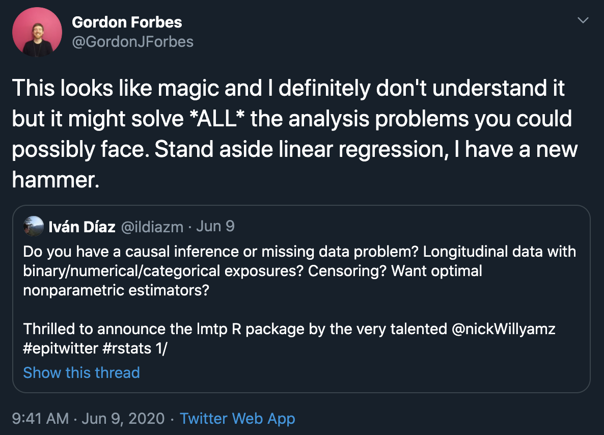

```{r setup, include=FALSE}
options(htmltools.dir.version = FALSE)
```

# Some Casual Causal Inference

$X$ is causally related to $Y$ if an intervention on $X$ has the potential to change $Y$

Counterfactuals and potential outcomes: what would have happened, if contrary to the fact, we did something other than we did.

$$Y_1 - Y_0$$

The fundamental problem of causal inference is that we do not observe all potential outcomes--we only observe one

Under untestable assumptions we can start to make claims about those potential outcomes

Confounding... 

Causal inference can be broken up into two distinct phases: 

1. Identification: the establishment of the theoretical plausibility to make causal claims from observational data
2. Estimation: the hard math part made easy by `lmtp`

---

# Deterministic interventions

The most commonly used causal effects are *deterministic* 

i.e., the ATE is a static, deterministic effect and considers the hypothetical difference in a population mean outcome if a binary treatment was applied to **all** observations versus if it was applied to **no** observations

For example, the difference in the risk of lung cancer if everyone in the population smoked compared to if no one in the population smoked.

Could also consider a dynamic, deterministic effect where treatment is deterministically applied as a function of observation covariates. 

---

# Feasibility and Positivity

Causal inference requires the positivity assumption. 

> all observations have a greater than zero chance of experiencing the intervention

Often violated with deterministic effects

Practically, deterministic interventions are often unfeasible or impossible to implement. 

As a solution, we can instead consider the effect of stochastic intervention where an observed value $A$ is replaced by a new value $A_{d(A|W)}$ based on applying a user-defined function $d(A,W)$ to $A$

<!-- > We may consider stochastic interventions in two equivalent ways: (1) where the equation $f_A$, giving rise to $A$, is replaced by a probabilistic mechanism $g_{\delta}(A|W)$ that differs from the original $g(A|W)$, or (2) where the observed value $A$ is replaced by a new value $A_{d(A|W)}$ based on applying a user-defined function $d(A,W)$ to $A$ -->
<!-- - Hitchhikers Guide to the tlverse -->

---

# Modified treatment policies

Motivating example: A researcher wants to know the effect of decreasing surgical operating times by 5 minutes on some outcome. It is likely that there is a global minimum operating time that surgery can successfully be completed within. We thus modify our intervention so that it respects the bounds of the data and avoids positivity violations. 

Now our intervention of interest is a decrease of 5 min in surgical operating time where such an intervention would be conceivably feasible

We will define it as a **modified treatment policy** (MTP). 

An important caveat of MTPs is that they are experimentally un-testable &#x2192; estimating the effect of a 5 min reduction on operating time would first require you to know what the original operating would have been for each surgery.

MTPs can be expanded to also depend on observation covariates: $d(A)$ &#x2192; $d(A,W)$

---

# the lmtp package

Install the **lmtp** package from [Github](https://github.com/nt-williams/lmtp):

```{r eval=FALSE, tidy=FALSE}
devtools::install_github("nt-williams/lmtp")
```

Originally developed to estimate the causal effects of longitudinal modified treatment policies

It generalizes many of the most common causal problems, such as static interventions

```{r echo = FALSE, out.width="35%", fig.align='center'}
knitr::include_graphics("lmtp.png")
```


---

# The estimators

The package provides 2 main estimators: 

- A targeted maximum likelihood estimator: `lmtp_tmle()`
- An estimator based on doubly robust unbiased transformations: `lmtp_sdr()`

Both estimators are considered multiply-robust 

- Estimators will remain consistent under model mis-specification in certain circumstances and are efficient under no mis-specification
- Allows for slower rates of converge in data-adaptive estimators (more on this later)

Both based on the study of the efficient influence function

Also provide an IPW estimator and a G-computation estimator. We don't recommend their use.

---

# Multiply-robust

```{r echo = FALSE}
knitr::include_graphics("bias-plot.png", dpi = 600)
```

---

# Multiply-robust

```{r echo = FALSE}
knitr::include_graphics("coverage-plot.png", dpi = 600)
```

---

# Machine learning

The two main estimators provided by **lmtp** are considered *doubly-robust*

This allows us to use machine learning for estimation while maintaining valid statistical inference 🤘

**lmtp** uses the **sl3** package to implement the Super Learner algorithm

The Super Learner combines multiple individual models into an optimal convex combination

If you want to learn more about the Super Learner, Kat Hoffman has a great introductory presentation available [here](https://github.com/hoffmakl/sl3-demo/blob/master/superlearning_slides_animated.pdf)

---

# Why lmtp

```{r echo = FALSE, out.width="90%"}

```

---

# Why lmtp

So why should you use it over `ltmle`, `tmle`, `tmle3`, `MatchIt`, `WeightIt`, `ipw`, `gforRmula`? 

Only package we know of that can estimate the effect of binary, categorical, and continuous exposures for static and dynamic deterministic interventions and modified treatment policies with missing outcomes while remaining completely non-parametric under one unified framework 🤯

Large emphasis on user experience went into the design

`lmtp::lmtp_sdr(data, trt, outcome, baseline, time_vary)` &#x2192; the analysts notation

VS

`ltmle::ltmle(data, Anodes, Cnodes, Lnodes, Ynodes)` &#x2192; equation notation

Super Learner is implemented using the *sl3* package which is much faster than the *SuperLearner* package

---

| Feature                         |    Status   |
|---------------------------------|:-----------:|
| Point treatment                 |   &check;   |
| Longitudinal treatment          |   &check;   |
| Modified treatment intervention |   &check;   |
| Static intervention             |   &check;   |
| Dynamic intervention            |   &check;   |
| Continuous treatment            |   &check;   |
| Binary treatment                |   &check;   |
| Categorical treatment           |   &check;   |
| Missingness in treatment        |             |
| Continuous outcome              |   &check;   |
| Binary outcome                  |   &check;   |
| Censored outcome                |   &check;   |
| Mediation                       |             |
| Super learner                   |   &check;   |
| Clustered data                  |   &check;   |
| Parallel processing             |   &check;   |
| Progress bars                   |   &check;   |

---

class: center, middle

# Demo

